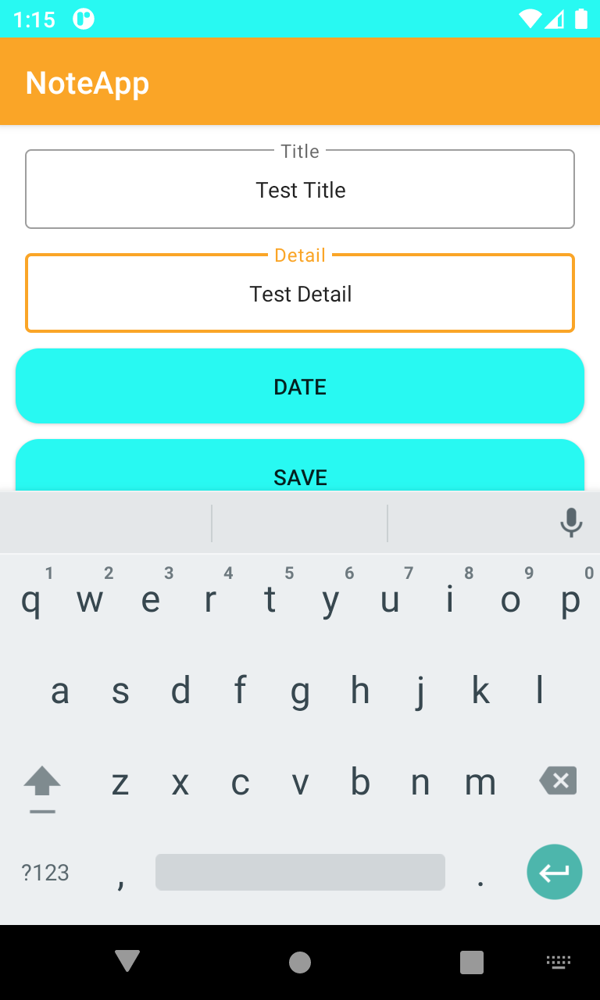
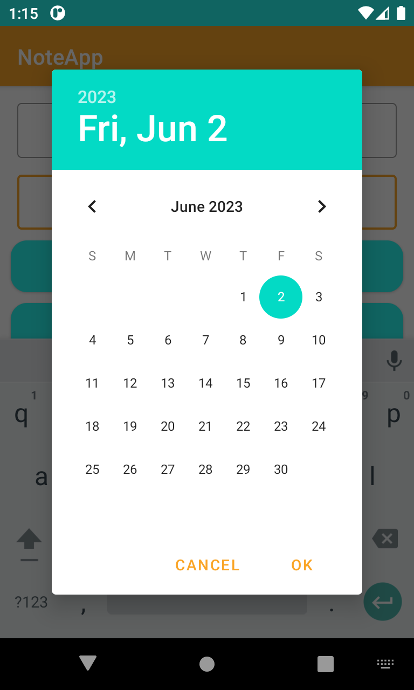
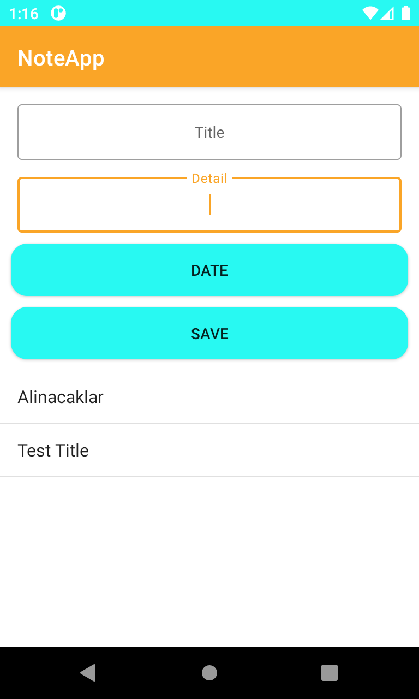
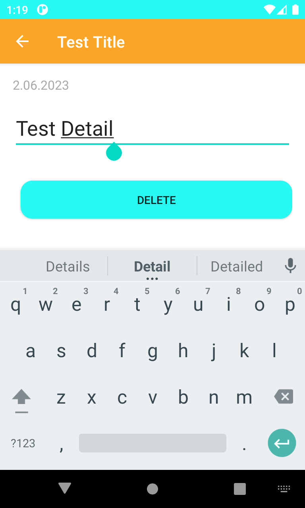
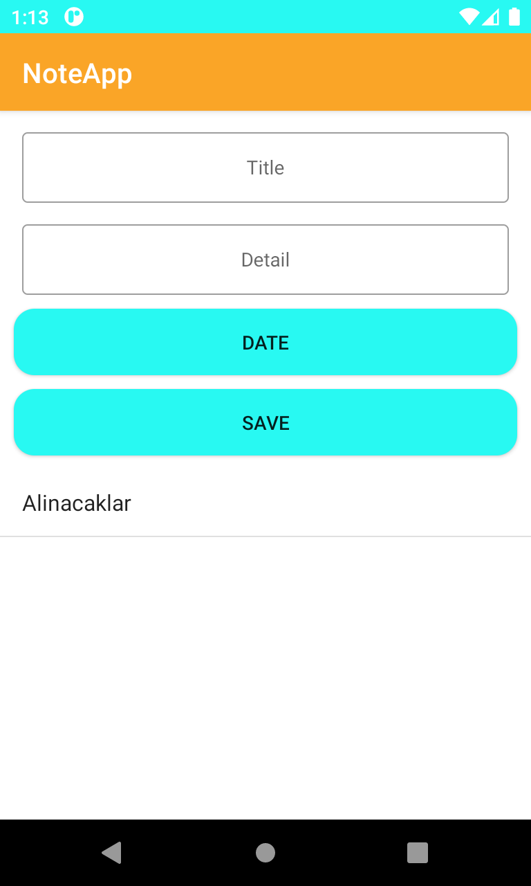

# Note Application
This repository demonstrates a note-taking application that allows users to create and manage their notes. The application is typically developed using a programming language such as Kotlin and employ various libraries for user interface design and data storage such as SQLite.

# Demo
- This application have add note, add note detail add, note date, update note detail, delete note detail, delete note functionallities like below.  
  
